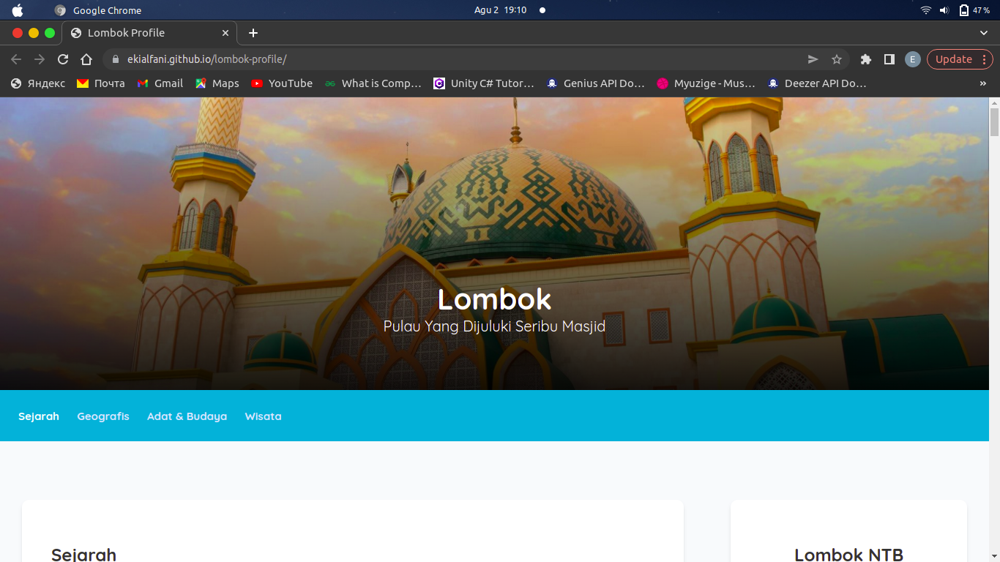

<h1 align="center">Lombok Profile</h1>
<p align="center">
    Displays information about the Island of Lombok, ranging from history, geography, culture and some of the famous tourist attractions on the Island of Lombok.
    <br>
    <br>
    <a href="https://ekialfani.github.io/lombok-profile/">View Demo</a>
    ·
    <a href="https://github.com/ekialfani/lombok-profile/issues">Report Bug</a>
    ·
    <a href="https://github.com/ekialfani/lombok-profile/issues">Request Feature</a>
</p>
<br>

Table of Contents
- [About The Projects](#about-the-projects)
  - [Built With](#built-with)
- [Getting Started](#getting-started)
  - [Installation](#installation)
- [Contributing](#contributing)
- [License](#license)
- [Contact](#contact)


## About The Projects


This is a static website that displays information about the Island of Lombok ranging from history, geographical location, customs and culture as well as some famous tourist attractions on the Island of Lombok.

### Built With
* HTML
* CSS
* JavaScript

## Getting Started
### Installation
* Clone the repo
```sh
git clone https://github.com/ekialfani/lombok-profile
```

## Contributing
Contributions are what make the open source community such an amazing place to learn, inspire, and create. Any contributions you make are **greatly appreciated**.

If you have a suggestion that would make this better, please fork the repo and create a pull request. You can also simply open an issue with the tag "enhancement". Don't forget to give the project a star! Thanks again!

1. Fork the Project
2. Create your Feature Branch (`git checkout -b feature/AmazingFeature`)
3. Commit your Changes (`git commit -m 'Add some AmazingFeature'`)
4. Push to the Branch (`git push origin feature/AmazingFeature`)
5. Open a Pull Request
   
## License
Distributed under the MIT License. See `LICENSE.txt` for more information.

## Contact
Eki Alfani - [instagram](https://www.instagram.com/ekialfni/) - ekialfani15@gmail.com.

Project link: https://github.com/ekialfani/lombok-profile